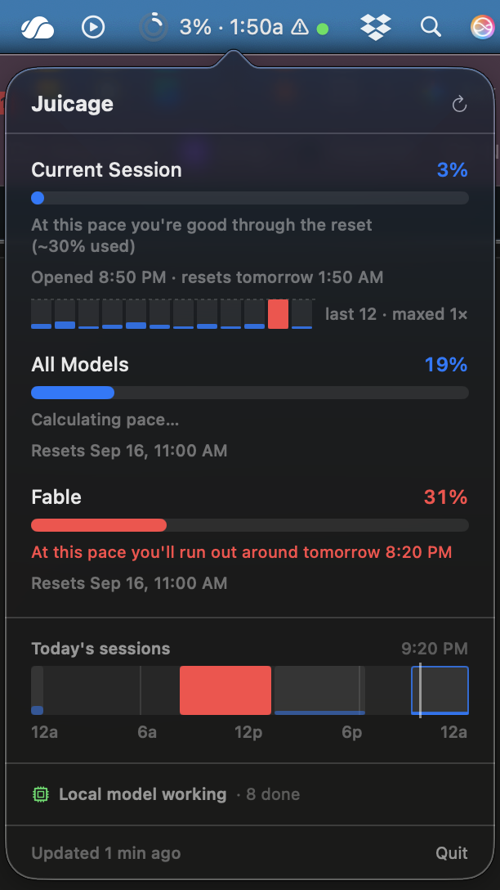

# Juicage

**A usage meter for [Claude.ai](https://claude.ai).**

*Juicage was called Tally through v1.4.1. Same app — update in place and your sign-in and settings carry over.*

A lightweight macOS **menu bar app** that shows your live Claude.ai usage at a
glance — session, weekly, and per-model limits — with colored rings that fill as
you go and a forecast of whether you're on pace to hit a limit. It also shows
when a **local** model (Ollama or LM Studio) is working. No dock icon; it runs
quietly in the background and refreshes on its own.

<p align="center">
  
</p>

> **Unofficial.** Juicage is not affiliated with, endorsed by, or supported by
> Anthropic. "Claude" is a trademark of Anthropic; it's used here only to
> describe what the app works with. Juicage reads usage data from claude.ai's own
> web session using an **undocumented internal API**, which can change or stop
> working at any time. Use at your own discretion and in line with Anthropic's
> Terms of Service.

> **Why you'll see "Tally" in file paths.** Juicage was called Tally until v1.5.
> The bundle identifier stayed `twoam.Tally` on purpose — macOS keys your saved
> sign-in and settings to it, so renaming it would sign every existing user out.
> That's why the app stores things under `~/Library/*/twoam.Tally/`. Nothing is
> sent anywhere; it's all local.

## Install

```sh
brew install --cask ryanbarnett-2am/juicage/juicage
```

Or download the `.dmg` from [Releases](https://github.com/ryanbarnett-2am/Juicage/releases/latest),
open it, and drag Juicage into Applications. Releases are signed with an Apple
Developer ID and notarized, so there's no security prompt to click through.

Juicage updates itself after that — `brew upgrade` is optional.

Requires **macOS 13 (Ventura) or later**. Universal (Apple Silicon and Intel).

## Features

### Claude.ai usage

- **Menu bar rings** — two concentric rings: outer is the current session, inner
  is the weekly cap. Each is colored **independently**, so a healthy session
  alongside a maxed-out week reads as neutral + red instead of both going red.
- **Three color tiers** — blue (on pace) → orange (getting close) → red (over
  pace, or very high), so there's a heads-up rather than a jump straight to red.
- **Pick what the menu bar counts** — the percentages beside the ring show the
  current session by default. Preferences lets you tick any combination of the
  limits your account actually has — the weekly all-models cap, a per-model cap
  like Fable — and each is labelled once there's more than one: **"Session 42% ·
  Week 71%"**. Three named limits is a wide menu bar and a 14-inch screen
  hasn't got it to spare, so the names can shrink to initials — **"C:42% W:71%
  F:12%"** — or go entirely: **"42% · 71% · 12%"**.
- **Detail popover** — per-workspace bars for the current session, the weekly
  all-models cap, and each per-model cap (e.g. Fable) your account has. Every
  workspace your login belongs to is shown.
- **Pace forecast** — projects your burn rate forward and answers in clock
  time: **"At this pace you'll run out around 5:10 PM"** when you're heading for
  a wall, or **"At this pace you're good through the reset (~16% used)"** when
  you aren't. Early in a window, when there isn't enough usage to project
  honestly, it says **"Calculating pace…"** instead of guessing — which keeps
  the first expensive prompt of a session from setting off a false alarm.
- **Extra usage** — with pay-as-you-go enabled, shows real spend against your
  cap: "$0.12 of $5.00 · $4.88 left".
- **When the window opened** — a session window is a rolling five hours anchored
  to whenever it opened, not a fixed clock, so the popover shows both ends:
  "Opened 12:10 PM · resets 5:10 PM". Start work an hour before one closes and
  you get an hour of it, not five.
- **Today's sessions** — a strip showing when each of today's session windows
  opened and closed, on a midnight-to-midnight axis with a line marking now.
- **Usage history** — one bar per closed window under each limit, with a faint
  full-height slot behind it so you can see what you left unused. Windows you
  maxed out draw red, and the caption says which question it's answering:
  "last 8 · maxed 3×" or "last 11 · ~83% unused". Recorded locally; nothing
  leaves your Mac.
- **Service status** — during a claude.ai outage the rings give way to a
  red/orange dot and a banner naming the issue.

### Local models (Ollama / LM Studio)

- A **green dot** in the menu bar while a local model is actively generating,
  and a popover row with the model, engine, elapsed time, and — for Ollama —
  tokens per second.
- A **notification when a job finishes**. With local models that's usually the
  moment that matters: you start a long generation and walk away.
- For LM Studio, the prompt is shown as a **task title** so you can tell which
  job is running. Ollama never records prompt text, so it shows the model name.
- Entirely optional — switch it off in Preferences.

## How it works

### Claude.ai

A hidden `WKWebView` stays parked on `claude.ai` and, every few minutes, calls
the site's own usage API with your logged-in cookies:

- `GET /api/organizations` → your workspaces
- `GET /api/organizations/{id}/usage` → usage JSON per workspace

There's **no HTML scraping and no browser automation** — it reads the same
structured data the settings page uses.

### Local models

Neither engine has an "am I busy" API, and both keep a model resident in memory
for several minutes after the work finishes — so keying off "a model is loaded"
would leave the indicator lit all afternoon. Juicage uses the one signal each
engine actually exposes:

- **Ollama** — tails `~/.ollama/logs/server.log`, which brackets every request
  (`processing task` … `all slots are idle`) and reports generation speed.
- **LM Studio** — reads `lms ps --json` for a real `idle` / `processingPrompt` /
  `generating` status, and `lms log stream` for the prompt text.

A GPU-utilization check acts as a backstop, so an engine that gets wedged can't
pin the indicator on indefinitely.

## Why the app isn't sandboxed

Juicage is **not** App Sandboxed, and that's deliberate: the local-model feature
cannot work inside the sandbox. Reading Ollama's log file and running the `lms`
CLI are both blocked by it, and neither engine exposes that information over
HTTP. Sandboxed, all Juicage could report is "a model is loaded" — which, as
above, stays true for minutes after the work ends.

If you'd rather keep the sandbox than have the feature, set
`ENABLE_APP_SANDBOX = YES` in the project and turn the feature off in
Preferences. Everything else works unchanged.

## Build & run

> The Xcode project and the bundle identifier (`twoam.Tally`) keep the old
> names on purpose. The identifier is what macOS keys your saved login and
> preferences to, so changing it would sign everyone out and reset their
> settings for no visible benefit — nobody ever sees a bundle ID.

Requires **Xcode** and **macOS 13 (Ventura) or later**. No Apple Developer
account is needed — the project signs ad-hoc, so a clean checkout builds as-is.

1. Open `ClaudeUsage.xcodeproj` in Xcode. *(The Xcode project keeps its original
   codename; the app it builds is **Juicage**.)*
2. Press **⌘R** to build and run.
3. The first launch shows a sign-in window — log into claude.ai once. Your login
   is remembered after that.

To build a shareable copy, run `./package-release.sh`, which produces
`Juicage-<version>.zip` on your Desktop.

Builds you make yourself are signed **ad-hoc**, so a copy
moved to another Mac needs a one-time right-click → **Open** to get past
Gatekeeper. Official **Releases** are signed with a Developer ID and notarized
by Apple, so those just double-click open.

## Privacy

Juicage talks to `claude.ai` and `status.claude.com`, plus `127.0.0.1` for the
local model engines. Nothing goes to any third party, and there are **no API
keys or credentials in the code** — your login lives in the app's own web-view
cookie store on your Mac.

The local-model feature reads data that never leaves your machine: Ollama's log
file and LM Studio's CLI output. Be aware that LM Studio's stream includes
**your prompt text**, which Juicage displays as the task title and may include in
a "finished" notification. It is never stored or transmitted, and *Show what
it's working on* in Preferences turns it off.

## A note on reliability

Because it depends on an undocumented API, the numbers can stop loading if
claude.ai changes the shape of that data (it has happened before). When that
occurs the popover shows a "Couldn't load usage" state, so you know it's broken
rather than silently wrong. Fixes usually mean updating the parsing in
`UsageParser.swift`.

The local-model integrations lean on a log format and a CLI that upstream can
change as well; if they do, the indicator simply stops appearing.

## License

[MIT](LICENSE) © 2026 Ryan Barnett
